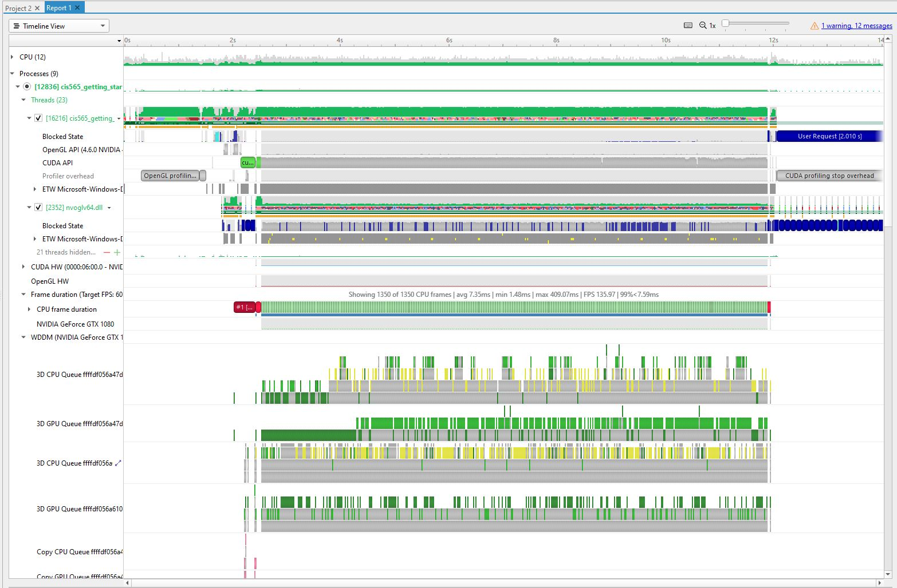

Project 0 Getting Started
====================

**University of Pennsylvania, CIS 565: GPU Programming and Architecture, Project 0**

Weihao Huang
* https://www.linkedin.com/in/weihao-huang-5166b7148/
* Tested on: Windows 10 Build 19043, AMD Ryzen 5 1600 @ 3.2GHz, 16GB RAM, GTX 1080 8GB (Personal)

### Project 0 Report

**Part 3.1.1 - Changing main.cpp**

**Part 3.1.2 - Nsight Analyze: Report and Timeline**

**Part 3.1.3 - Nsight debug**

**Part 3.2 - Checking WebGL**

**Part 3.1.1 - Checking DXR (made it pink)**

